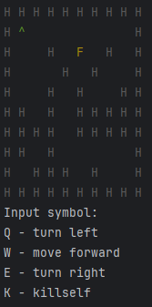
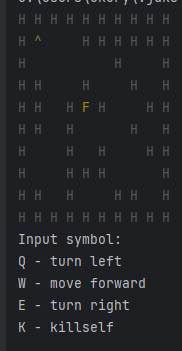
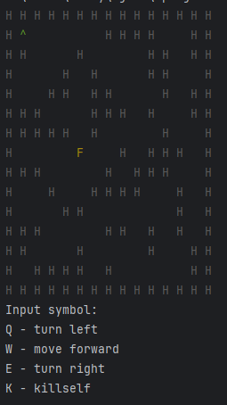

Java-консольное приложение MyRobot

Суть игры заключается в том, чтобы с помощью поворотов влево\вправо и движения вперед, дойти до финиша. При запуске игры карта генерируется случайным образом, но она точно проходима





Также можно менять размер карты




Чтобы скомпилировать 

```commandline
javac -d out src\org\app\Main.java src\org\domain\controller\*.java src\org\domain\model\*.java src\org\io\*.java src\org\levels\*.java src\org\render\*.java
```

Чтобы запустить

```commandline
java -cp out org.app.Main
```